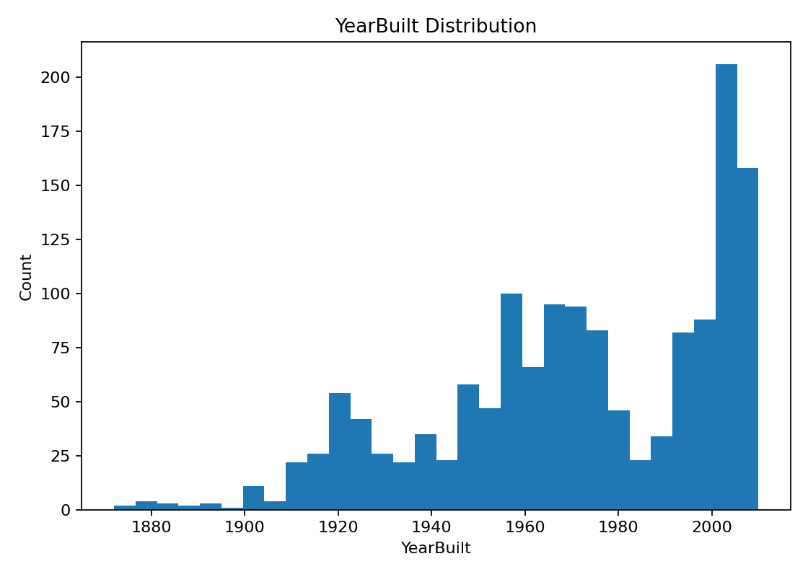

# EDA Report

**Input file**: `train.csv`

**Rows x Cols**: 1460 x 81

**Dtypes**: object: 43, int64: 35, float64: 3

## Missing Values

Top missing columns:

- PoolQC: 1453 (99.52%)
- MiscFeature: 1406 (96.30%)
- Alley: 1369 (93.77%)
- Fence: 1179 (80.75%)
- MasVnrType: 872 (59.73%)
- FireplaceQu: 690 (47.26%)
- LotFrontage: 259 (17.74%)
- GarageYrBlt: 81 (5.55%)
- GarageCond: 81 (5.55%)
- GarageType: 81 (5.55%)

## Target: SalePrice

- Distribution often right-skewed; consider log1p transform for modeling.

## Numeric Feature Distributions (samples)

## Correlation with Target (Top)

- OverallQual: 0.791
- GrLivArea: 0.709
- GarageCars: 0.640
- GarageArea: 0.623
- TotalBsmtSF: 0.614
- 1stFlrSF: 0.606
- FullBath: 0.561
- TotRmsAbvGrd: 0.534
- YearBuilt: 0.523
- YearRemodAdd: 0.507

### Scatter vs Target (Top correlated)

## Outliers

Visual check suggests potential large-area outliers around GrLivArea > 4000.

## Categorical Features (samples)

## Recommendations

- Treat missing-as-absence columns (e.g., PoolQC, Alley, Fence, FireplaceQu, garage/basement quality fields) as categorical with an explicit 'None' level.

- Consider log1p transform of the target for modeling; inspect and potentially cap extreme area values such as GrLivArea.

- Feature engineering: total floor/basement areas (e.g., TotalSF = 1stFlrSF + 2ndFlrSF + TotalBsmtSF), age features (YrSold - YearBuilt, YrSold - YearRemodAdd).

- For tree-based models later: impute numeric with median; categorical via one-hot with rare-category grouping.

- Note: columns like MSSubClass are categorical codes for dwelling types rather than continuous numbers.
